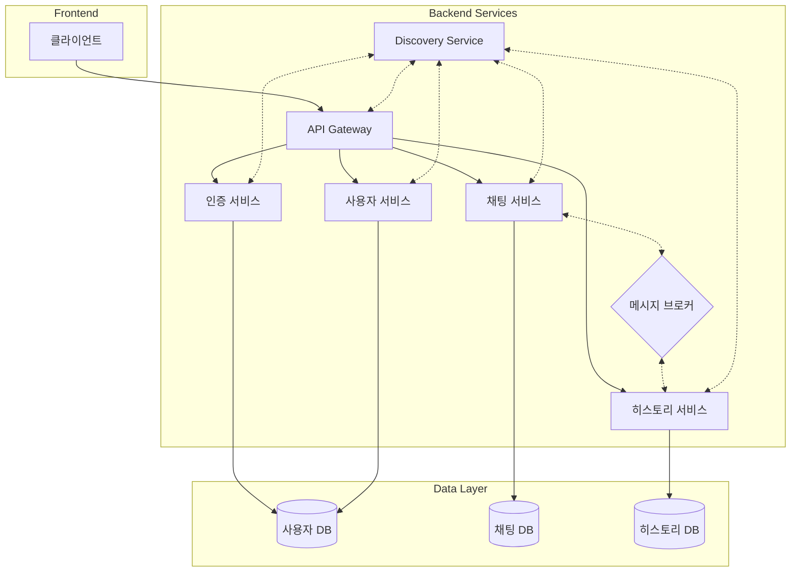
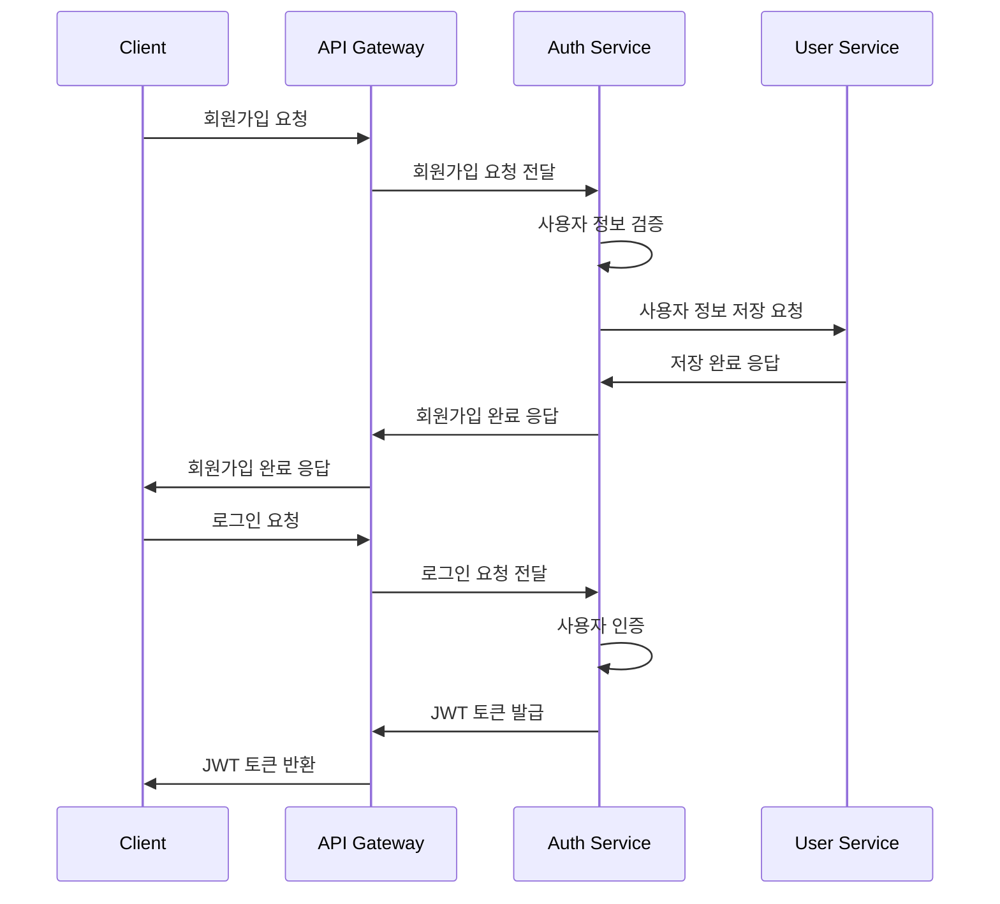
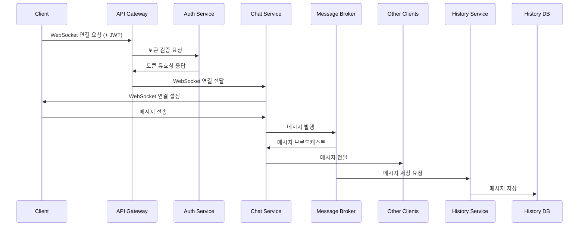
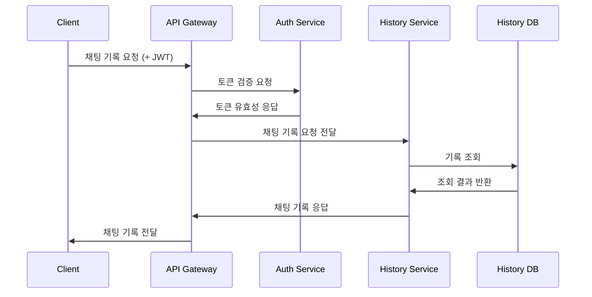

# 메이크스타 코딩 테스트

## 프로젝트 소개

> 여기에 작성된 코드들은 다음과 같은 환경에서 작성되었음을 알려드립니다.  
> - IDE: Curosr
> - AI의 도움을 받아 코드를 작성했습니다.
> - claude-3.7-sonnet 모델을 사용하였습니다.
> - Agent와 MCP를 최대한 활용하였습니다.

이 프로젝트는 채팅을 위한 서버와 클라이언트 두 가지 주요 기능을 포함하고 있습니다.

- [문제 보기](./TEST.md)

- [삽질 보기](./TROUBLE_SHOOTING.md)

## 시스템 개요

MakeStar는 마이크로서비스 아키텍처(MSA)를 기반으로 구축된 실시간 채팅 애플리케이션입니다. 사용자들이 개인 또는 그룹 채팅방을 통해 실시간으로 메시지를 주고받을 수 있는 기능을 제공합니다. 확장성과 유지보수성을 고려하여 각 기능별로 독립적인 서비스로 분리하여 구성하였습니다.

### 주요 기능

- 사용자 등록 및 인증
- 실시간 채팅 (개인 및 그룹)
- 메시지 히스토리 저장 및 조회
- 사용자 상태 관리
- 채팅방 관리 (생성, 참여, 나가기)

## 시스템 아키텍처

MakeStar 채팅 시스템은 다음과 같은 마이크로서비스로 구성되어 있습니다:



### 기술 스택

- **백엔드**:
  - Java 11+
  - Spring Boot 2.7.x
  - Spring Cloud (Gateway, OpenFeign, Eureka)
  - Spring Security + JWT
  - Spring WebSocket
  - JPA / Hibernate
  - PostgreSQL / MongoDB
  - RabbitMQ / Kafka

- **프론트엔드**:
  - Vue.js 3
  - TypeScript
  - Vite
  - Pinia (상태 관리)
  - WebSocket

- **인프라**:
  - Docker & Docker Compose
  - Gradle (빌드 도구)
  - Git (버전 관리)

## 서비스 설명

### Discovery Service

Discovery Service는 서비스 등록 및 검색을 담당합니다:

- Netflix Eureka 서버를 기반으로 구현
- 모든 마이크로서비스의 등록 처리
- 서비스 위치 정보 제공
- 상태 모니터링 및 장애 감지

### API Gateway

API Gateway는 모든 클라이언트 요청의 진입점 역할을 합니다. 주요 책임은 다음과 같습니다:

- 요청 라우팅: 클라이언트 요청을 적절한 마이크로서비스로 라우팅
- 인증 및 권한 부여: JWT 토큰 검증을 통한 사용자 인증
- 요청/응답 로깅: 시스템 모니터링을 위한 로깅
- 부하 분산: 서비스 인스턴스 간 부하 분산

### 인증 서비스 (Auth Service)

인증 서비스는 사용자 인증 및 권한 관리를 담당합니다:

- 사용자 등록 (회원가입)
- 로그인 및 JWT 토큰 발급
- 토큰 갱신 및 검증
- 비밀번호 재설정

### 사용자 서비스 (User Service)

사용자 서비스는 사용자 정보 및 프로필 관리를 담당합니다:

- 사용자 프로필 관리
- 사용자 검색
- 친구 목록 관리
- 사용자 상태 관리 (온라인/오프라인)

### 채팅 서비스 (Chat Service)

채팅 서비스는 실시간 메시징 기능을 제공합니다:

- WebSocket 기반 실시간 메시지 교환
- 채팅방 생성 및 관리
- 메시지 브로드캐스팅
- 읽음 확인 기능

### 히스토리 서비스 (History Service)

히스토리 서비스는 채팅 메시지의 저장 및 조회를 담당합니다:

- 메시지 영구 저장
- 채팅 기록 조회
- 메시지 검색
- 채팅 통계 제공

## 워크플로우

### 사용자 등록 및 로그인 워크플로우



### 실시간 채팅 워크플로우



### 채팅 기록 조회 워크플로우



## 실행 방법

### 사전 요구사항

- JDK 11 이상
- Gradle 7.0 이상
- Docker 및 Docker Compose (선택 사항)
- Node.js 16 이상 (프론트엔드 개발 시)

### 백엔드 서비스 실행

#### 방법 1: 개별 서비스 실행

```bash
# 프로젝트 클론
git clone https://github.com/yourusername/makestar.git
cd makestar

# 빌드
./gradlew clean build

# 서비스 순차적 실행 (별도의 터미널에서)
java -jar services/discovery-service/build/libs/discovery-service-0.0.1-SNAPSHOT.jar  # 먼저 실행
java -jar services/api-gateway/build/libs/api-gateway-0.0.1-SNAPSHOT.jar
java -jar services/auth-service/build/libs/auth-service-0.0.1-SNAPSHOT.jar
java -jar services/user-service/build/libs/user-service-0.0.1-SNAPSHOT.jar
java -jar services/chat-service/build/libs/chat-service-0.0.1-SNAPSHOT.jar
java -jar services/history-service/build/libs/history-service-0.0.1-SNAPSHOT.jar
```

#### 방법 2: Docker Compose 사용

```bash
# 도커 이미지 빌드 및 실행
docker-compose -f docker/compose/docker-compose.yml up -d
```

### 프론트엔드 실행

```bash
# 프론트엔드 디렉토리로 이동
cd frontend/web-client

# 의존성 설치
npm install

# 개발 서버 실행
npm run dev

# 프로덕션 빌드
npm run build
```

### API 엔드포인트

기본적으로 서비스는 다음 포트에서 실행됩니다:

- Discovery Service: http://localhost:8761
- API Gateway: http://localhost:8080
- Auth Service: http://localhost:8081
- User Service: http://localhost:8082
- Chat Service: http://localhost:8083
- History Service: http://localhost:8084
- Frontend: http://localhost:3000

## 보안

시스템은 다양한 보안 기능을 통합하고 있습니다:

- JWT 기반 인증 및 권한 부여
- API Gateway에서의 중앙 집중식 인증
- 비밀번호 암호화 저장
- HTTPS 통신 지원
- CORS 설정
- 입력 유효성 검사

## 데이터베이스

[데이터베이스 아키텍처 보기](DB_ARCHITECTURE.md)

## 구현하지 못한 것

[최초 설계](TROUBLE_SHOOTING.md#아키텍처-설계-kubernetes-기반)에는 고려하여 설계 하였으나 시간과 리소스를 고려하여 아키텍처를 변경하면서 아래의 항목들을 제외하게 되었습니다.

### 확장성 및 성능

MakeStar 채팅 시스템은 처음부터 확장성을 고려하여 설계되었습니다:

- 각 마이크로서비스는 독립적으로 수평 확장이 가능합니다.
- 메시지 브로커(RabbitMQ/Kafka)를 사용하여 비동기 통신을 구현하였습니다.
- 서비스 디스커버리를 통한 동적 서비스 등록 및 검색이 가능합니다.
- 데이터베이스 샤딩 및 레플리케이션 지원을 고려한 설계입니다.

### 모니터링 및 로깅

시스템 모니터링을 위한 도구와 접근 방식:

- 중앙 집중식 로깅 (ELK 스택)
- 분산 추적 (Spring Cloud Sleuth)
- 서비스 상태 모니터링 (Spring Boot Actuator)
- 성능 메트릭 수집 및 분석 (Prometheus + Grafana)
