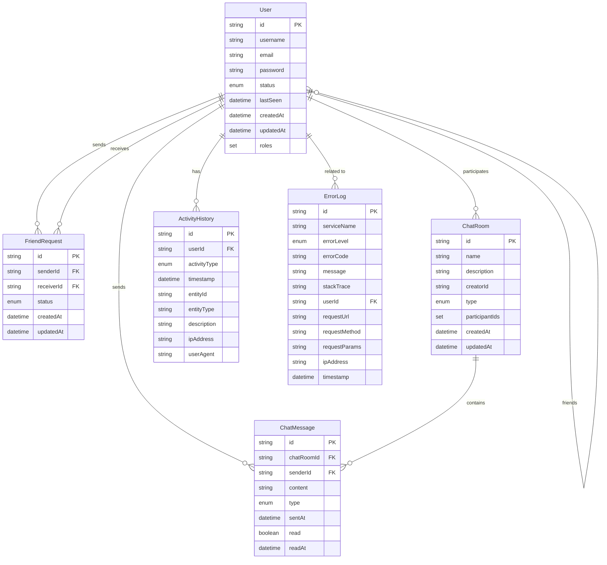

# MakeStar 데이터베이스 아키텍처

이 문서는 MakeStar 채팅 애플리케이션의 데이터베이스 구조를 설명합니다. 마이크로서비스 아키텍처를 기반으로 각 서비스는 자체 데이터베이스를 사용하지만, 여기서는 전체적인 엔티티 관계를 중심으로 설명합니다.

## 엔티티 관계 다이어그램



## 테이블 정의

### User (사용자)

사용자 정보를 저장하는 테이블입니다.

| 컬럼명       | 데이터 타입      | 설명                              | 제약 조건                    |
|-------------|-----------------|----------------------------------|----------------------------|
| id          | VARCHAR(36)     | 사용자 식별자 (UUID)               | Primary Key                |
| username    | VARCHAR(50)     | 사용자 이름                       | Unique, Not Null          |
| email       | VARCHAR(100)    | 이메일 주소                       | Unique, Not Null          |
| password    | VARCHAR(100)    | 암호화된 비밀번호                  | Not Null                  |
| status      | VARCHAR(20)     | 사용자 상태 (ONLINE, OFFLINE, AWAY, BUSY) | Not Null, Default 'OFFLINE' |
| last_seen   | TIMESTAMP       | 마지막 접속 시간                   |                            |
| created_at  | TIMESTAMP       | 계정 생성 시간                     | Not Null                  |
| updated_at  | TIMESTAMP       | 계정 정보 업데이트 시간             |                            |

#### 관련 테이블

| 테이블명       | 설명                              | 관계                           |
|--------------|----------------------------------|--------------------------------|
| user_roles   | 사용자 역할 정보                   | User의 roles (ElementCollection) |
| user_friends | 사용자 친구 관계                   | User 간의 ManyToMany 관계       |

### FriendRequest (친구 요청)

사용자 간의 친구 요청 정보를 저장하는 테이블입니다.

| 컬럼명       | 데이터 타입      | 설명                              | 제약 조건                    |
|-------------|-----------------|----------------------------------|----------------------------|
| id          | VARCHAR(36)     | 요청 식별자 (UUID)                | Primary Key                |
| sender_id   | VARCHAR(36)     | 요청 보낸 사용자 ID               | Foreign Key (User)        |
| receiver_id | VARCHAR(36)     | 요청 받은 사용자 ID               | Foreign Key (User)        |
| status      | VARCHAR(20)     | 요청 상태 (PENDING, ACCEPTED, REJECTED) | Not Null, Default 'PENDING' |
| created_at  | TIMESTAMP       | 요청 생성 시간                     | Not Null                  |
| updated_at  | TIMESTAMP       | 요청 상태 업데이트 시간             | Not Null                  |

### ChatRoom (채팅방)

채팅방 정보를 저장하는 테이블입니다.

| 컬럼명       | 데이터 타입      | 설명                              | 제약 조건                    |
|-------------|-----------------|----------------------------------|----------------------------|
| id          | VARCHAR(36)     | 채팅방 식별자 (UUID)              | Primary Key                |
| name        | VARCHAR(100)    | 채팅방 이름                       | Not Null                  |
| description | VARCHAR(200)    | 채팅방 설명                       |                            |
| creator_id  | VARCHAR(36)     | 채팅방 생성자 ID                   | Foreign Key (User)        |
| type        | VARCHAR(20)     | 채팅방 유형 (DIRECT, GROUP)       | Not Null, Default 'GROUP' |
| created_at  | TIMESTAMP       | 생성 시간                         | Not Null                  |
| updated_at  | TIMESTAMP       | 업데이트 시간                     |                            |

#### 관련 테이블

| 테이블명               | 설명                              | 관계                           |
|----------------------|----------------------------------|--------------------------------|
| chat_room_participants | 채팅방 참가자 정보               | ChatRoom의 participantIds (ElementCollection) |

### ChatMessage (채팅 메시지)

채팅 메시지 정보를 저장하는 테이블입니다.

| 컬럼명       | 데이터 타입      | 설명                              | 제약 조건                    |
|-------------|-----------------|----------------------------------|----------------------------|
| id          | VARCHAR(36)     | 메시지 식별자 (UUID)              | Primary Key                |
| chat_room_id| VARCHAR(36)     | 채팅방 ID                        | Foreign Key (ChatRoom)     |
| sender_id   | VARCHAR(36)     | 발신자 ID                        | Foreign Key (User)         |
| content     | TEXT            | 메시지 내용                       | Not Null                  |
| type        | VARCHAR(20)     | 메시지 유형 (TEXT, IMAGE, FILE, SYSTEM) | Not Null, Default 'TEXT' |
| sent_at     | TIMESTAMP       | 발송 시간                         | Not Null                  |
| read        | BOOLEAN         | 읽음 여부                         | Not Null, Default false   |
| read_at     | TIMESTAMP       | 읽은 시간                         |                            |

### ActivityHistory (활동 내역)

사용자 활동 내역을 저장하는 테이블입니다.

| 컬럼명       | 데이터 타입      | 설명                              | 제약 조건                    |
|-------------|-----------------|----------------------------------|----------------------------|
| id          | VARCHAR(36)     | 활동 내역 식별자 (UUID)            | Primary Key                |
| user_id     | VARCHAR(36)     | 사용자 ID                        | Foreign Key (User)         |
| activity_type | VARCHAR(50)   | 활동 유형                         | Not Null                  |
| timestamp   | TIMESTAMP       | 활동 시간                         | Not Null                  |
| entity_id   | VARCHAR(36)     | 관련 엔티티 ID                    | Not Null                  |
| entity_type | VARCHAR(50)     | 관련 엔티티 유형                   |                            |
| description | VARCHAR(200)    | 활동 설명                         |                            |
| ip_address  | VARCHAR(50)     | 활동 발생 IP 주소                  |                            |
| user_agent  | VARCHAR(200)    | 사용자 브라우저/기기 정보           |                            |

### ErrorLog (오류 로그)

시스템 오류 로그를 저장하는 테이블입니다.

| 컬럼명       | 데이터 타입      | 설명                              | 제약 조건                    |
|-------------|-----------------|----------------------------------|----------------------------|
| id          | VARCHAR(36)     | 로그 식별자 (UUID)                | Primary Key                |
| service_name| VARCHAR(50)     | 서비스 이름                       | Not Null                  |
| error_level | VARCHAR(20)     | 오류 수준 (INFO, WARNING, ERROR, CRITICAL) | Not Null          |
| error_code  | VARCHAR(50)     | 오류 코드                         |                            |
| message     | TEXT            | 오류 메시지                       | Not Null                  |
| stack_trace | TEXT            | 오류 스택 트레이스                  |                            |
| user_id     | VARCHAR(36)     | 관련 사용자 ID                    | Foreign Key (User)         |
| request_url | VARCHAR(200)    | 요청 URL                         |                            |
| request_method | VARCHAR(20)  | HTTP 메소드                       |                            |
| request_params | TEXT         | 요청 파라미터                      |                            |
| ip_address  | VARCHAR(50)     | 요청 IP 주소                      |                            |
| timestamp   | TIMESTAMP       | 발생 시간                         | Not Null                  |

## 인덱스 전략

### User

- `username_idx`: `username` 컬럼에 대한 인덱스 (로그인 및 사용자 검색)
- `email_idx`: `email` 컬럼에 대한 인덱스 (로그인 및 사용자 검색)
- `status_idx`: `status` 컬럼에 대한 인덱스 (온라인 사용자 필터링)

### FriendRequest

- `sender_id_idx`: `sender_id` 컬럼에 대한 인덱스 (보낸 요청 조회)
- `receiver_id_idx`: `receiver_id` 컬럼에 대한 인덱스 (받은 요청 조회)
- `status_idx`: `status` 컬럼에 대한 인덱스 (상태별 필터링)

### ChatRoom

- `name_idx`: `name` 컬럼에 대한 인덱스 (채팅방 검색)
- `type_idx`: `type` 컬럼에 대한 인덱스 (채팅방 유형별 필터링)
- `creator_id_idx`: `creator_id` 컬럼에 대한 인덱스 (생성자별 채팅방 조회)

### ChatMessage

- `chat_room_id_idx`: `chat_room_id` 컬럼에 대한 인덱스 (채팅방별 메시지 조회)
- `sender_id_idx`: `sender_id` 컬럼에 대한 인덱스 (사용자별 메시지 조회)
- `sent_at_idx`: `sent_at` 컬럼에 대한 인덱스 (시간순 정렬)
- `read_idx`: `read` 컬럼에 대한 인덱스 (읽지 않은 메시지 필터링)

### ActivityHistory

- `user_id_idx`: `user_id` 컬럼에 대한 인덱스 (사용자별 활동 내역 조회)
- `activity_type_idx`: `activity_type` 컬럼에 대한 인덱스 (활동 유형별 필터링)
- `timestamp_idx`: `timestamp` 컬럼에 대한 인덱스 (시간순 정렬)
- `entity_id_idx`: `entity_id` 컬럼에 대한 인덱스 (관련 엔티티별 활동 조회)

### ErrorLog

- `service_name_idx`: `service_name` 컬럼에 대한 인덱스 (서비스별 오류 조회)
- `error_level_idx`: `error_level` 컬럼에 대한 인덱스 (오류 수준별 필터링)
- `timestamp_idx`: `timestamp` 컬럼에 대한 인덱스 (시간순 정렬)
- `error_code_idx`: `error_code` 컬럼에 대한 인덱스 (오류 코드별 필터링)
- `user_id_idx`: `user_id` 컬럼에 대한 인덱스 (사용자별 오류 조회)
``` 