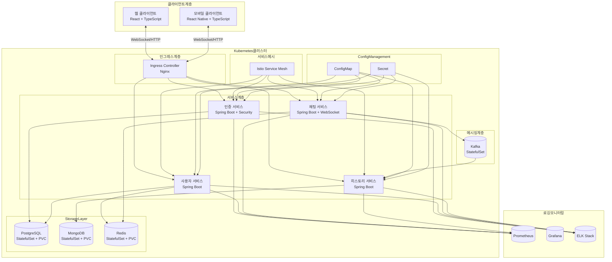
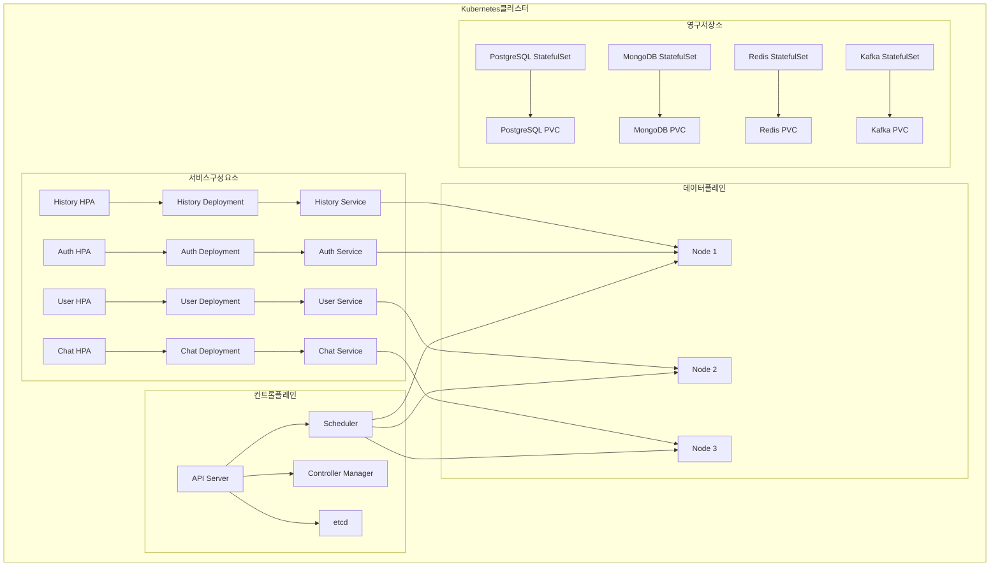
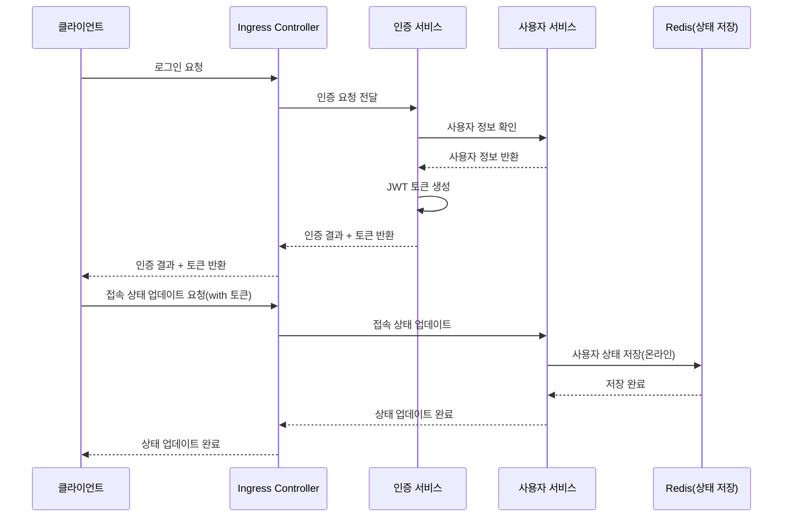
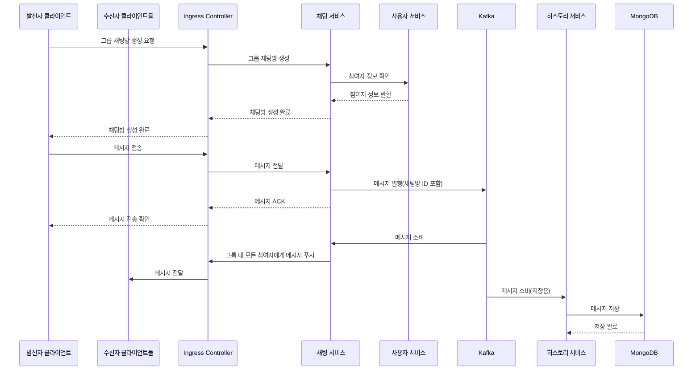
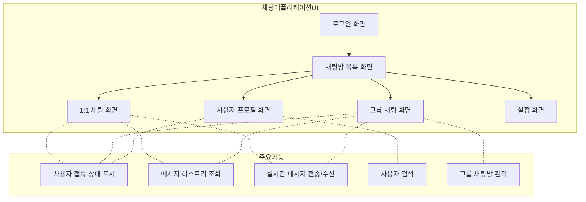
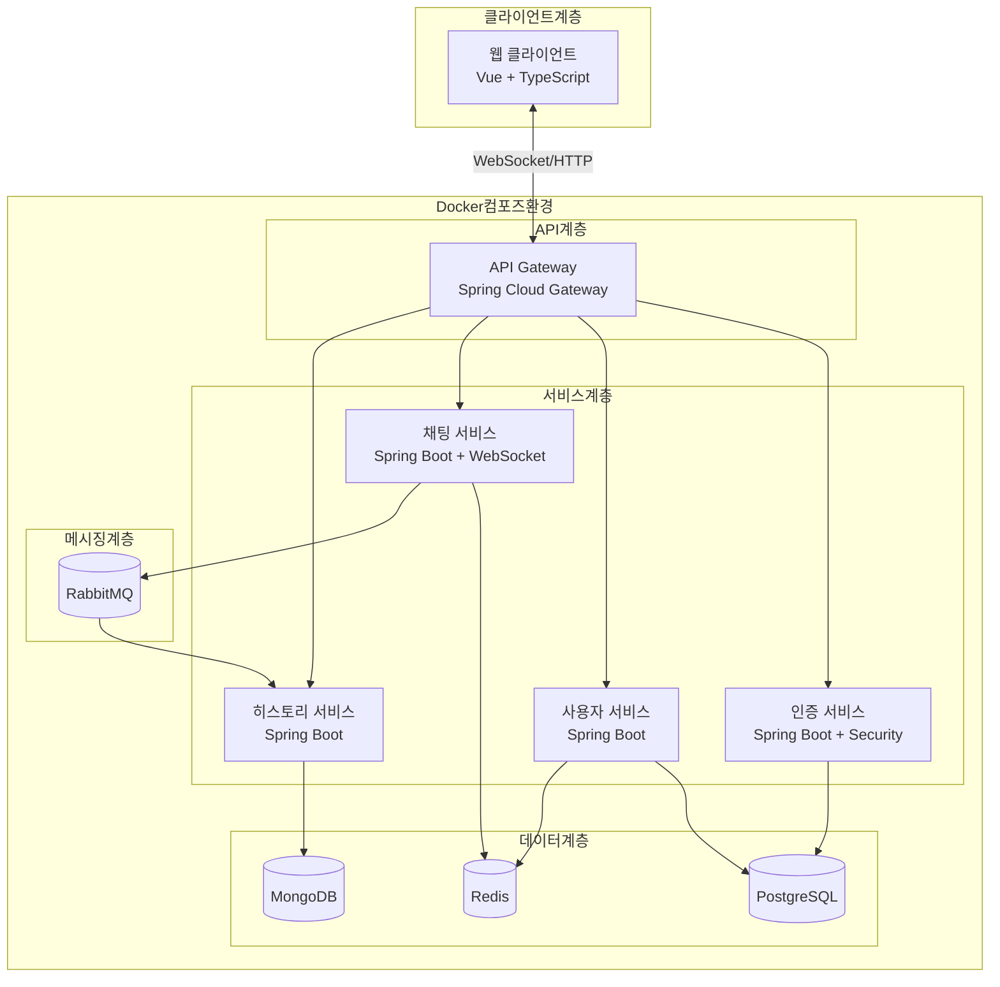
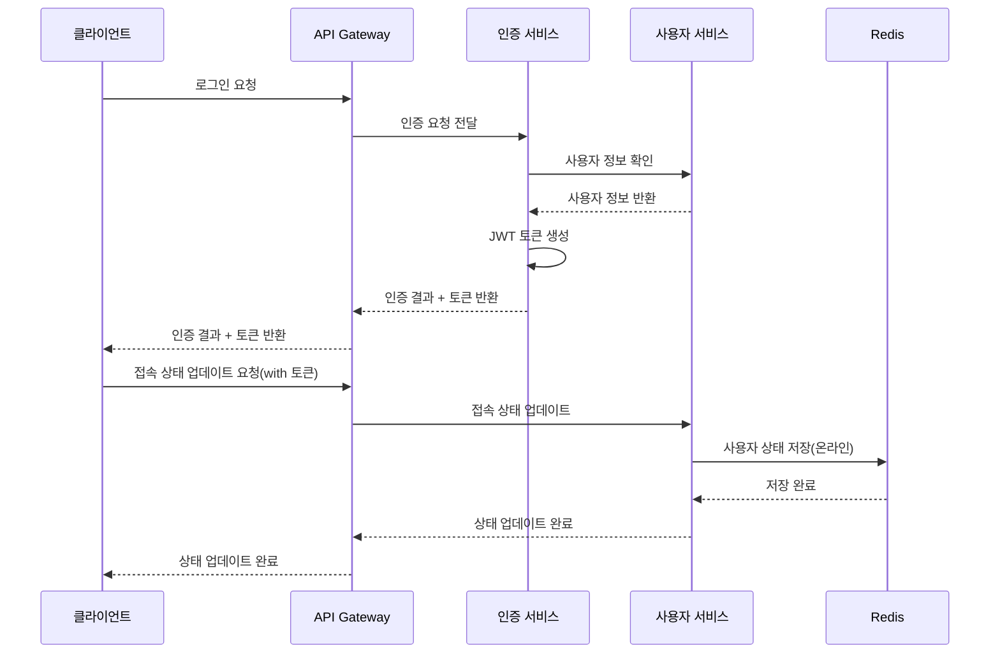
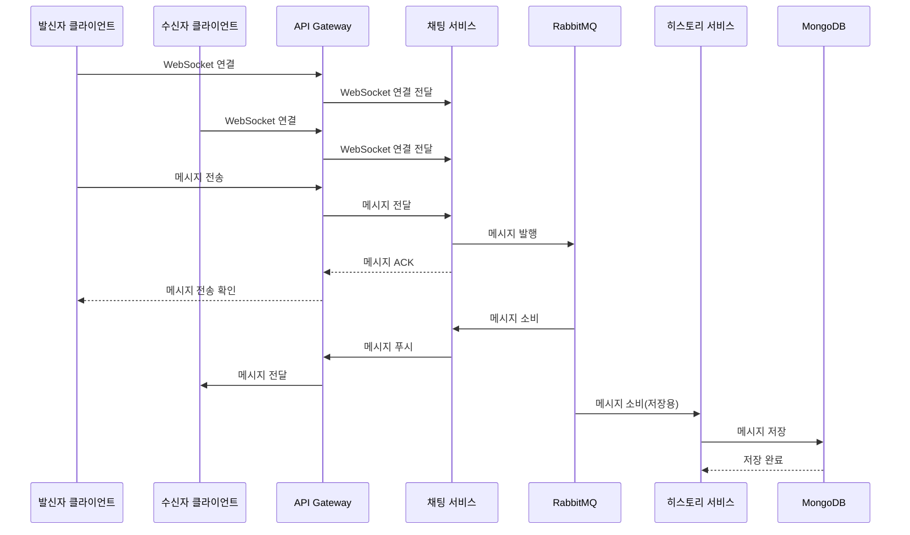
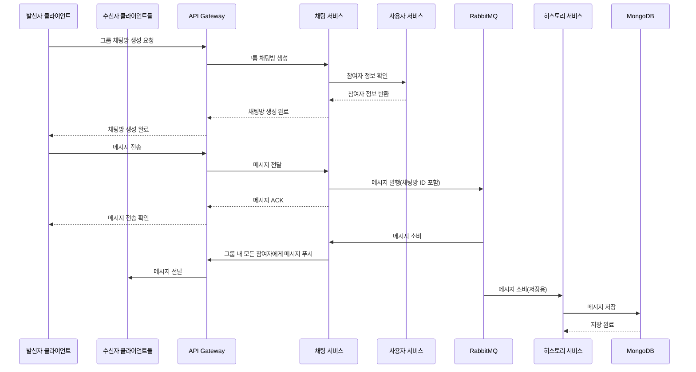

# 요구사항 분석

## 주요 요구사항:
- 실시간 채팅 시스템 구현
- 다수 사용자 지원을 위한 부하 분산 및 확장성 고려
- 1:1 채팅 및 그룹 채팅(최대 100명) 지원
- 웹과 앱 모두 지원하는 서버 구성
- 사용자 접속 상태 표시 기능
- 채팅 로그 기록 필수
- 텍스트 메시지만 지원(최대 1,000자)

# 작업에 앞서...

최근 긴 휴식을 마치고 이직을 준비하면서 오랫동안 코딩을 하지 않아 뭔가를 다시 개발하면서 실전 감각을 익히려고 했는데 개인 PC에는 개발과 관련된 것이 아무것도 없었다.

IDE는 당연하고 자바나 파이썬, node.js 같은건 아예 없었다. 이전 회사에서 제공해준 맥북에 모든 세팅이 되어 있었고, 깃헙 계정 조차 업무용으로 별도로 만들어 사용했기 때문이다.

이력서 작성부터 해야 했는데 아무런 편집 도구도 없어 이 참에 AI의 도움을 받아볼까 해서 예전에 잠깐 설치만 해봤던 커서를 사용하기로 했다.

근데 이게 옛날에 파이참이나 깃헙 코파일럿에서 보던 멍청한 AI들과는 차원이 다른 생산성 향상을 시켜 주었다.

코드 뿐만 아니라 이력서 마저 자동 완성 기능을 제공하고, 그 퀄리티 마저 좋았다. 완전 신세계.... -0-

이력서를 쓰고, 다듬고, 많은 서류 탈락을 겪으며 포트폴리오까지 작성하면서 커서와 클로드를 통한 AI 생태계에 점점 관심을 갖게 되었고, 그 결과 내 유튜브 알고리즘은 온통 AI 뿐인 상태가 되었다.

그리고 더 퀄리티 좋고 편한 방법을 찾아 이제는 MCP와 각종 룰을 먼저 세팅하고 이 과제를 하려고 한다.

파이썬은 이미 한차례 과제를 통해 어느정도 세팅한 템플릿이 있는데 자바와 프론트엔드는 없어 커서 룰과 좀 더 효율적인 AI 작업을 위한 MCP 세팅부터 시작하려 한다.

## 커서 룰

### 자바 백엔드 및 아키텍처

먼저 누군가 잘 만들어 놓은 룰을 참조하기 위해 커서 커뮤니티와 깃헙을 뒤져 봤다. 젠장... 영어다... 뭐 좋다 어차피 AI가 번역도 엄청 잘 해준다.

그런데 번역해도 별로 맘에 들지 않는다.

그럼 AI를 잘 사용하기 위한 커서 룰도 AI한테 시켜봐야겠다.

아주 오래전 요기요 입사 전 지인들과 공부 겸 재미삼아 했던 토이 프로젝트 깃랩 repo를 뒤져봤다.

아직 남아있다... 그런데 왜 항상 과거의 내가 짠 코드는 부끄러운 것인지...

괜찮다. 어차피 저 코드를 쓸게 아니고 그때 나름대로 철저하게 지켰던 코드 컨벤션이나 네이밍 룰, 프로젝트 구조 등만 룰로 만드는데 참조하면 된다.

프로젝트 코드를 참조시켜 각종 커서 룰을 AI에게 만들어 달라고 했다. 그리고 그 결과물이 이 프로젝트에 일부 사용되었다.

[커서 룰](.cursor/rules)

자바와 스프링, MSA 관련 룰 들을 검토 후 나에게 맞게 살짝 수정했다.

아주 만족스럽다.

## 프론트엔드

이제 프론트엔트 차례다. 최근에 리액트로 개발을 했었으니 일단 리액트로 해볼까 했다.

그런데 지원하려고 하는 곳이 vue를 사용한다는 것을 작업 와중에 깨닫고 다시 Vue도 추가로 룰을 만들어 달라고 했다.

Vue는 코딩한지 진짜 오래돼서 요즘 기술 트렌드나 어떻게 발전하고 있는지도 모르는 상태였는데 작성된 룰을 보니 역시나 모르는게 좀 있다... 차근차근 이것도 공부 해야겠다.

이제 각종 룰을 기반으로 이 프로젝트에 맞는 룰을 다시 작성하고 과제를 시작하려고 한다.

# 아키텍처 설계 (Kubernetes 기반)

## 아키텍처 및 워크플로우

### 전체 시스템 아키텍처



### 쿠버네티스 아키텍처 구성 요소



### 사용자 인증 및 로그인 워크플로우



### 1:1 채팅 워크플로우


### 그룹 채팅 워크플로우



### 채팅 애플리케이션 UI 구조



## 주요 기술 구성 요소

1. **프론트엔드**:
   - React + TypeScript로 구현된 웹 클라이언트
   - WebSocket 기반 실시간 통신
   - 사용자 상태 관리

2. **백엔드 마이크로서비스**:
   - Kubernetes: 컨테이너 오케스트레이션 및 관리
   - Ingress Controller: 외부 트래픽 라우팅
   - 서비스 메시(Istio): 서비스 간 통신, 보안, 라우팅
   - Spring Boot 기반 마이크로서비스: 각 도메인별 기능 구현

3. **데이터 저장 및 처리**:
   - PostgreSQL StatefulSet: 사용자 정보 저장
   - MongoDB StatefulSet: 메시지 및 채팅 로그 저장
   - Redis StatefulSet: 실시간 상태 정보, 세션 관리
   - Kafka StatefulSet: 메시지 브로커, 비동기 통신

4. **인프라 및 운영**:
   - Kubernetes: 컨테이너 오케스트레이션
   - Horizontal Pod Autoscaler: 자동 확장 기능
   - ConfigMap/Secret: 설정 및 민감 정보 관리
   - Prometheus/Grafana: 모니터링 및 알림
   - ELK Stack: 로깅 및 로그 분석

5. **배포 전략**:
   - CI/CD 파이프라인: Github Action, ArgoCD
   - 블루/그린 배포 또는 카나리 배포 지원
   - GitOps 방식의 인프라 구성 관리

> 업무 상 구현해야 하는 시스템이라면 이렇게 개발 했을 것 같다.  
문제는 시간이 한정적인 코딩 테스트이기도 하고, 이런 시스템을 구축할 환경이 없다.  
로컬에서는 도커를 사용한다 해도 한계가 있는지라...  
그래서 구현해야 할 기능들을 최소화 하기로 했다.

# 아키텍처 설계 (MVP)

## 간소화된 아키텍처 및 워크플로우

### 전체 시스템 아키텍처 (Docker Compose 기반)



### Docker Compose 구성 요소

각 컨테이너는 Docker Compose에서 관리되며, 다음과 같은 서비스로 구성됩니다:

1. **API Gateway**: 클라이언트 요청을 적절한 서비스로 라우팅
2. **인증 서비스**: 사용자 인증 및 토큰 관리
3. **사용자 서비스**: 사용자 프로필 및 상태 관리
4. **채팅 서비스**: WebSocket 연결 및 실시간 메시지 처리
5. **히스토리 서비스**: 채팅 기록 저장 및 조회
6. **데이터베이스**: PostgreSQL, MongoDB, Redis
7. **메시지 브로커**: RabbitMQ

### 사용자 인증 및 로그인 워크플로우



### 1:1 채팅 워크플로우



### 그룹 채팅 워크플로우



## 주요 기술 구성 요소

1. **프론트엔드**:
   - Vue + TypeScript로 구현된 웹 클라이언트
   - WebSocket 기반 실시간 통신
   - 사용자 상태 관리
   - Vuetify 또는 Element Plus와 같은 UI 라이브러리 활용

2. **백엔드 마이크로서비스**:
   - Spring Boot 기반 마이크로서비스 아키텍처
   - Spring Cloud Gateway: 라우팅 및 로드 밸런싱
   - Spring Security + JWT: 인증 및 권한 관리
   - Spring WebSocket: 실시간 양방향 통신

3. **데이터 저장 및 처리**:
   - PostgreSQL: 사용자 정보 및 인증 데이터 저장
   - MongoDB: 메시지 및 채팅 로그 저장
   - Redis: 실시간 상태 정보, 세션 관리, 채팅방 정보
   - RabbitMQ: 메시지 브로커, 비동기 통신

4. **Docker Compose 설정**:
   - 각 서비스별 컨테이너 정의
   - 네트워크 및 볼륨 설정
   - 환경 변수 관리
   - 종속성 및 시작 순서 정의

## Docker Compose 파일 구조 (예시)

```yaml
version: '3.8'

services:
  # API 게이트웨이
  api-gateway:
    build: ./api-gateway
    ports:
      - "8080:8080"
    environment:
      - SPRING_PROFILES_ACTIVE=docker
    depends_on:
      - auth-service
      - user-service
      - chat-service
      - history-service

  # 인증 서비스
  auth-service:
    build: ./auth-service
    environment:
      - SPRING_PROFILES_ACTIVE=docker
      - SPRING_DATASOURCE_URL=jdbc:postgresql://postgres:5432/authdb
    depends_on:
      - postgres

  # 사용자 서비스
  user-service:
    build: ./user-service
    environment:
      - SPRING_PROFILES_ACTIVE=docker
      - SPRING_DATASOURCE_URL=jdbc:postgresql://postgres:5432/userdb
      - SPRING_REDIS_HOST=redis
    depends_on:
      - postgres
      - redis

  # 채팅 서비스
  chat-service:
    build: ./chat-service
    environment:
      - SPRING_PROFILES_ACTIVE=docker
      - SPRING_REDIS_HOST=redis
      - SPRING_RABBITMQ_HOST=rabbitmq
    depends_on:
      - redis
      - rabbitmq

  # 히스토리 서비스
  history-service:
    build: ./history-service
    environment:
      - SPRING_PROFILES_ACTIVE=docker
      - SPRING_DATA_MONGODB_URI=mongodb://mongodb:27017/chathistory
      - SPRING_RABBITMQ_HOST=rabbitmq
    depends_on:
      - mongodb
      - rabbitmq

  # PostgreSQL 데이터베이스
  postgres:
    image: postgres:14
    environment:
      - POSTGRES_PASSWORD=password
      - POSTGRES_USER=chatapp
    volumes:
      - postgres-data:/var/lib/postgresql/data
    ports:
      - "5432:5432"

  # MongoDB 데이터베이스
  mongodb:
    image: mongo:5
    volumes:
      - mongodb-data:/data/db
    ports:
      - "27017:27017"

  # Redis 데이터베이스
  redis:
    image: redis:7
    volumes:
      - redis-data:/data
    ports:
      - "6379:6379"

  # RabbitMQ 메시지 브로커
  rabbitmq:
    image: rabbitmq:3-management
    ports:
      - "5672:5672"
      - "15672:15672"
    volumes:
      - rabbitmq-data:/var/lib/rabbitmq

volumes:
  postgres-data:
  mongodb-data:
  redis-data:
  rabbitmq-data:
```

## 배포 및 실행 방법

1. **환경 요구 사항**:
   - Docker 및 Docker Compose 설치
   - Java 11 이상
   - Node.js 14 이상

2. **빌드 및 실행 명령**:
   ```bash
   # 전체 애플리케이션 빌드 및 실행
   docker-compose up --build
   
   # 백그라운드에서 실행
   docker-compose up -d
   
   # 특정 서비스만 재시작
   docker-compose restart service-name
   
   # 로그 확인
   docker-compose logs -f service-name
   ```

3. **서비스 접근**:
   - 웹 클라이언트: http://localhost:8080
   - RabbitMQ 관리 콘솔: http://localhost:15672
   - API 직접 접근: http://localhost:8080/api/{service-name}

이 MVP 아키텍처는 원래 설계의 핵심 기능을 유지하면서 로컬 개발 환경에서 쉽게 실행할 수 있도록 간소화되었습니다. 필요에 따라 더 많은 기능이나 서비스를 추가할 수 있는 확장성도 갖추고 있습니다.

# 삽질의 기록

## 준비 완료

커서에 친절하게 내가 하려고 하는 일들과 기술 스택 및 각각의 룰을 설정하고, 이 프로젝트에 맞는 프로젝트 룰도 만들어 설정했다.

프로젝트 룰도 AI로 기존의 다른 룰을 참고하여 모노레포로 구성하도록 했더니 프로젝트 구조가 살짝 내가 원하는 것과 달라 수정해달라고 했더니 이번엔 잘 해줬다.

설정된 룰을 기반으로 채팅 시스템 구현을 해달라고 요청했고, 약 10분의 시간이 지난 후 완료되었다.

아직 코드는 보지 않은 상태에서 현재 작성된 코드들을을 기반으로 README를 작성해 달라고 했고, 완성된 문서를 검토 후 일부 수정했다.

하면 할수록 느끼는 건데 이제는 AI 없이 개발 하라고 하면 힘들 것 같다. 생산성이 너무 다르다... 아무튼 AI와 놀면서 잘 작성된 코드를 계속 고치다 말아먹고 리셋한 경험이 있어 이제 완성된 코드를 커밋한 후 실제로 동작시켜 보면서 코드를 살펴보려고 한다.

이클립스나 IntelliJ 같은 자바 전용 IDE가 아닌 vscode 기반의 IDE에서는 자바 개발을 해보지 못해 이것부터 잘 해봐야겠다.

## 완벽하지 않은 코드

우선, AI가 작성한 코드를 열어봤더니 전체적인 구조만 잡혀있고 상세 코드 구현은 되어 있지 않았다. 난 분명히 코드 구현을 해 달라고 했는데 얘가 말귀를 반만 알아 먹은 것 같다.

그래서 구체적으로 다시 각각의 서비스들을 구현해 달라는 지시를 여러차례 했고, 여러번의 지시와 수행을 통해 전체 코드가 구현 되었다.

그런데 아직 남은 것이 테스트 코드 작성도 되어 있지 않았고, 프론트엔드도 작성되어 있지 않았다.

다시 지시를 했고, 코드를 만들어 냈다. 다시 코드를 열어봤고, 부족한 주석을 달고, 작성된 JPA 모델 코드를 바탕으로 DB 설계 문서를 만들라고 지시했다.

아직 코드는 실행 못 해봤고, 설계 문서는 생각보다 잘 만들어줬다.

## 과욕이었나...

정말 오랜만에 자바로 뭔가 개발을 하고 있다. 너무 오래 되긴 했나보다.

자바 버전도 엄청 올라갔고, 스피링 프레임워크도 그에 맞춰 버전이 많이 올라갔다. 가능하면 익숙한 버전보다 최신 버전에 가까운 버전을 사용하고 싶었다.

그런데 이것 저것 문제를 해결하는 과정에서 느낀 건 아직 커서라는 IDE도 완벽히 다룰 줄 모르면서 너무 과욕을 부린 것이 아닌가 싶었다.

일단 나는 vscode에서 자바 개발을 해 본적이 없다. 스프링 기반으로 개발했을 때는 STS를 사용했고, 최근엔 인텔리J를 많이 사용하고 있어 파이참을 많이 사용했던 나로서는 지금 당장 자바 개발을 하라고 한다면 인텔리J를 선택했을 것이다.

vscode에 자바 extension을 설치하고 이런 저런 삽질을 하면서 내가 자바 환경변수 조차 설정을 안하고 이러고 있었구나 싶었다.

Maven을 주로 사용하던 나는 Gradle을 STS에서 제공해 주는 플러그인을 통해 편하게 사용만 했었는데 이것도 문제였다.

집에 게임용으로 둔 데스크탑 윈도우 PC에서 오랜만에 개발 해보겠다고 최근 5년간 사용했던 맥 환경과 너무 다르고 불편하다는 것을 삽질을 해가며 몸으로 깨닫고 있다.

맥에선 homebew 같은걸로 간단히 설치하던걸 직접 다운받고 압축풀고 환경변수 세팅하고... 물론 윈도우에도 비슷한 도구가 있는건 알고 있다. 그런데 그럴거면 그냥 맥북에서 했겠지...

옆에 있는 맥북에 모니터 2대를 연결하고 키보드 마우스를 스위칭 해가면서 데스크탑과 왔다 갔다 하는 것이 귀찮아 여기다 이러고 있는건데... ㅠㅠ

아무튼 이 글을 쓰고 있는 지금 이 순간엔 스프링 extension을 이제서야 설치하고 있는 중이다....

## 시간이 부족하다...

수 많은 삽질 끝에 기록을 남기려고 한다.

일단 수 많은 삽질의 근본적인 원인은 너무 오랫동안 자바와 스프링을 이용한 개발을 하지 않아 까먹은 것이 많고, 5년이란 세월동안 자바, 스프링 부트, 스프링 클라우드 등 버전이 많이 올라갔고, 사용법이 은근히 많이 바꼈다는 것이다.

### vscode

나는 이클립스나 이클립스 기반의 STS에서 주로 자바 개발을 했었다. vscode를 많이 사용해 보긴 했지만 주로 vue와 같은 프론트엔드 개발이나 단순한 마크다운 폅집 위주로만 사용해 봤다.

차라리 IntelliJ 였다면 파이썬 개발을 하면서 파이참을 사용했었기 때문에 큰 문제가 없었을 것이다.

Cursor가 vscode 기반이고, 여기서 자바 개발환경을 구축하고 처음 사용해 보다 보니 난관이 많았다.

원래는 윈도우 데스크탑에서 시작했다가 설계를 마친 후 도커가 필수적이라 생각해 맥북으로 옮겨왔다.

그러면서 맥북에서 처음 자바 개발환경을 구축해 봤다.

파이썬처럼 버전을 관리하는 jenv가 있다는 걸 알았고, 이미 파이썬 개발 환경이 구축되어 있어 최대한 비슷하게 해보려고 했다.

여기까진 문제가 없었으나 발목을 잡은 것은 파이썬의 pyenv, virtualenv, autoenv로 프로젝트 디렉토리별로 자동으로 버전을 .env로 부터 설정을 받아와 변경하도록 했는데 이것이 스프링 부트를 실행하는 환경에서 local 설정을 .env에서 불러오도록 되어 있어 충돌이 발생했다.

또, 스프링 클라우드를 쓸거면 그냥 예전에 했던 것 처럼 Config 서버를 사용하면 편했을 것을 하나라도 마이크로서비스를 줄여보겠다고 application.yaml 파일을 사용하도록 하느라 DB 연결정보 같은 민감한 정보를 local 설정을 따로 사용하게 하면서 위에 언급한 삽질을 하게 됐다.

이 문제는 application-local.yaml을 사용하게 하면서 해결 되긴 했지만 vscode에서 스프링부트에 환경변수 주입하는 것도 처음이라 시간을 많이 허비했다. ㅠㅠ

또, 자바 컴파일이 리펙토링 과정에서 바로 반영되지 않아 자바 프로젝트 패널에 제대로 반영되지 않거나 빌드가 캐시로 인해 정상동작 하지 않는 등 여러 문제를 겪었다.

나중에 본격적으로 자바 개발을 해야 한다면 Cursor와 IntelliJ와 병행해서 사용해야 할 듯 하다.

### 자바, 스프링 버전 그리고 의존성 문제

처음 AI에게 코드를 생성해 달라고 했을 때는 룰 세팅에 버전에 대한 지시를 명확하게 하지 않았었다.

자바11+, 스프링 부트, 스프링 클라우드 사용 이런식으로만 했더니 같은 repo안에 있는 다른 서비스들이 다 제각기 다른 버전을 사용하게 설정이 되었다.

또, User 모델과 같이 공통으로 사용해야 할 클래스들도 각각의 서비스에 따로 만들어 사용하게 되어 있었다.

디렉토리 구조도 마음에 들지 않아 이런 것들을 리팩토링 하고, 의존성을 고치고, 충돌나고, 다시 고치고...

거의 하루를 꼬박 이런 삽질을 한 것 같다.

또, h2 DB를 사용하던 것을 그래도 그럴듯 하게 만들어보고 싶어 supabase를 사용하도록 변경했다.

그런데 이 과정에서도 supabase를 처음 사용해봐서 이것 저것 삽질을 많이 했다.

지금 이 글을 쓰고 있는 시점엔 이런 문제들은 다 해결하고, 정상적으로 백엔드 서비스들이 동작 하는 것 까지 확인한 상태다.

그런데 이제 과제 제출 기한이 하루도 남지 않은 시점에서 코테도 해야 하는데 프론트엔드는 서버를 실행해 보지도 못했다.

일단 여기까지 한 상태에서 코테를 보고 다시 프론트엔드를 봐야겠다.

아... 그리고 이거 도커로 올리려면 오늘 밤을 새워야 하려나... ㅠㅠ